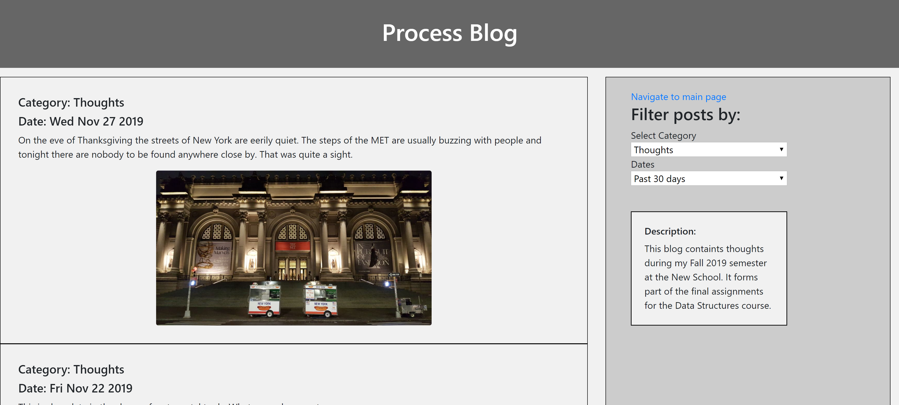
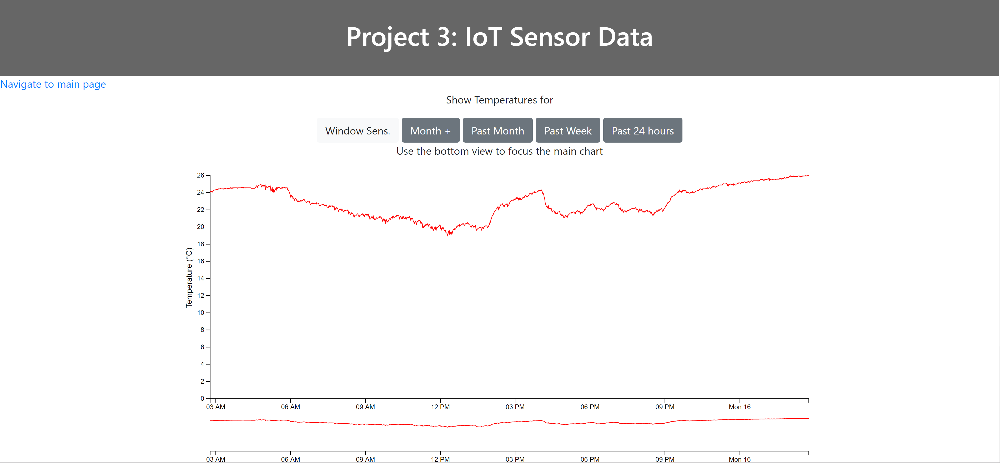
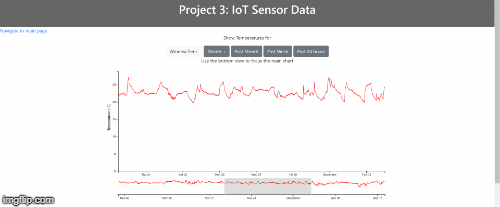
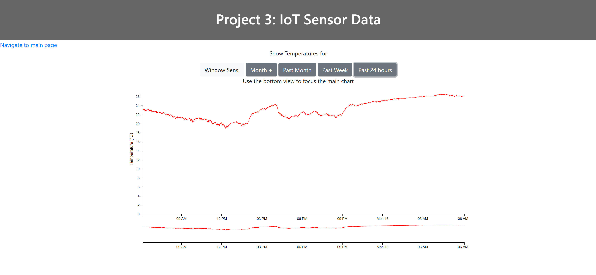

## MSDV PGDV5110 Final assignments 1,2 and 3 
(due: 12/16/2019 6pm)


### Summary:
------------------------------


This readme page describes details of a Web application that was constructed on Amazon Web Services
using Node Express, PostgreSQL, DynamoDB, Javascript, Html and CSS.
The three final assignments are based on work that was done throughout the Fall 2019 semester.
The assignments are briefly summarized herein. More details are given in each subsection:

* [Assignment 1](https://github.com/visualizedata/data-structures/blob/master/final_assignment_1.md):
Use Alcoholics Anonymous (AA) meeting website data to construct a web application,
that runs with a server-side PostgreSQL database coupled to a front-end html website with an interactive map
that contain the meeting details.

* [Assignment 2](https://github.com/visualizedata/data-structures/blob/master/final_assignment_2.md):
Construct a basic blog website that uses AWS DynamoDB to store details of the blog posts.

* [Assignment 3](https://github.com/visualizedata/data-structures/blob/master/final_assignment_3.md):
Record at least a month's Internet of Things sensor data, store it in a PostgreSQL database and 
build a website that retrieves and plots the data.

Note that the course focuses on the back-end server side data structures rather than the front-end webpage design.


### Web application main page:
--------------------------


The main web page is a plain interface to facilitate user navigation.
This page is the `index.html` page hosted in the application public folder.


-------------------------------

## Assignment 1: AA meetings


The AA meeting project weekly assignments are spread over various weeks
and are briefly summarized below for reference:

* [Week 1](https://github.com/acdreyer/data-structures/tree/master/wAssignment_01):
Extract the body html from online webpages.
* [Week 2](https://github.com/acdreyer/data-structures/tree/master/wAssignment_02):
Parse through one of the pages to extract meeting address data.
* [Week 3](https://github.com/acdreyer/data-structures/tree/master/wAssignment_03):
Geocode each address and store in a JSON file.
* [Week 4](https://github.com/acdreyer/data-structures/tree/master/wAssignment_04):
Create an AWS PostgreSQL database and store AA meeting data therein.
* [Week 6](https://github.com/acdreyer/data-structures/tree/master/wAssignment_06):
Query data from the database.
* [Week 7](https://github.com/acdreyer/data-structures/tree/master/wAssignment_07):
Go back to the original AA meeting html files and now exctract all data from
all the AA meeting pages (previously it was done only for one).
* [Week 10](https://github.com/acdreyer/data-structures/tree/master/wAssignment_10):
Create a web application to connect server-side responses from client-side requests.
* [Week 11](https://github.com/acdreyer/data-structures/tree/master/wAssignment_11):
Do the visual framework design for the final webpage.


Some questions that may arise as you bind the data to the end-user interface:
What information does the end user need? How? Why?
From the data on AA's meeting list, which data is relevant for display in this project? How should it be displayed?
What does a map marker represent? A meeting group? A meeting? A location?
What is the minimum amount of data that can be queried to provide the necessary data for the visual representation?


Your work will be assessed on:
The integrity of the data
The integrity of the database
The efficiency of the queries and page load
The choices of data structures
The inclusion of relevant data
The coherence and organization of your code and repository
The method for binding the data to the visual representation


----------------------------

## Assignment 2: Process blog


#### 1. Process Blog Introduction:

The Process Blog weekly assignments are briefly introduced, after which the final 
assignment details are supplied:

The weekly assignment details are found in:

* [Week 5](https://github.com/acdreyer/data-structures/tree/master/wAssignment_05):
Create an AWS DynamoDB NoSQL database and start storing process blog data.
* [Week 6](https://github.com/acdreyer/data-structures/tree/master/wAssignment_06):
Query data from the database.
* [Week 10](https://github.com/acdreyer/data-structures/tree/master/wAssignment_10):
Create a web application to connect server-side responses from client-side requests.
* [Week 11](https://github.com/acdreyer/data-structures/tree/master/wAssignment_11):
Do the visual framework design for the final webpage.


#### 2. Process Blog User Interface

Two main types of information is required by the user:
- information to navigate the blog entries 
- the blog entries themselves

Abovementioned implied splitting the browser window into two sections; a main 
window showing the article/blog information and a sidebar that includes navigation
elements (and possible future additional information; depending on future page growth.)





#### 3. Process Blog Navigation and Query


DynamoDB allows only sorting and searching through the primary and sort keys, 
hence these are the only navigable interfaces available to the user.
The front-end navigation is therefore based on the
chosen primary key of `Category` and the associated sort key of `Date`. 
Using these keys the user is given access to filter the blog entries
using "category" and "date" drop-down menus.


Whereas it might theoretically be possible for the user to filter blogs with individual days, 
the amount of blog entries and data make longer term ranges for a more user friendly implementation.
Subsquently of date ranges of the
`Past 30 days`, `3 months`, `6 months` and `1 year` were chosen, with the default view
being `Past 30 days` and the category `Thoughts`. This view is to facilitate quick loading
that will have at least one blog entry. The category was also chosen to be "thoughts"
and not directly focused on any of the projects to make it more clear that the user is 
indeed on a blog and not on any of the other "project websites".

User input is obtained from the drop-down menus using JQuery with an 
event listener that calls a function as follows:

```
$(document.body).on('change', "#categoryDropdown", function() {
    keepCat = this.value;
    populatedoc(keepCat, keepRange);
});

```

This sends a `get` request to the server using AJAX as follows, with the
query parameters of `category` and `dtrange` in the query string:

```
$.get('/processblog', { category: keepCat, dtrange: keepRange }, function(data) {
    var htmlposts = small_template(data);
    $('#maincontentarea').html(htmlposts)
});
```
The server employs if statements to assign a DynamoDB query start and end date with the Javascript `moment.js`
library; with `endDate = moment();` and `startDate = moment().subtract(1, 'months')`.


#### 4. Process Blog Response and Content Display

Since the user will likely want to read latest content first,
the blog entries are sorted and returned in *descending order* by including the `ScanIndexForward: false`
parameter in the DynamoDB query object. This allows the user to see the latest entry first
and scroll down toward older entries.


The data is sent from the server to the client as an object that includes and array of objects.
Hence no additional html is sent to the client, but only the filtered list of blog posts. 
The data is then compiled on the client side using a `handlebar` template. 
Sending only the data from the server without additional html is deemed more efficient 
than compiling the html and data on the server and sending the full html, since 
a lot of the html text with div tags are repeated information. Although, it should 
be mentioned that a further future improvement could include
precompiling handlebar templates save the client-side from having to 
compile the template and merge the data, in which case it would only have to merge the data.


```
{{#blogpost}}
  <div class="col-xs-4">
    <div class='post'>
      <h5>Category: {{category}}</h5> <h5>Date: {{date}}</h5>
      <p>{{content}}</p>  
<div class="blogimage">

</div>
    </div>
  </div>
{{/blogpost}}
```
The resulting html is as follows:


Images were also included in all the blog posts, but these were not sent from the server
as part of the blog entry data. Low resolution images are served from the public folder
and only image file names are sent as part of the database query. 
As the user loads a set of blog posts, 
the browser automatically downloads these from the public folder. The blog post 
are then displayed each in its own content `<div>` element as follows:


#### 5. Progress Blog Conclusion:

The process blog was likely the least challenging of the three assignments due to 
the flexible nature of the DynamoDB database. Managing changes in the database
was significantly easier than the PostgreSQL database and it was found to be
especially useful to have the AWS GUI web interface to manually delete and/or
update individual records. However, the added flexibility did come
at a price, because only the primary key (and associated sort key) can be used
to query data.

The application running for assessment is located at:
[http://34.203.246.48:8080/final2_processblog.html](http://34.203.246.48:8080/final2_processblog.html)

<!--Your work will be assessed on:-->
<!--The integrity of the data-->
<!--The integrity of the database-->
<!--The efficiency of the queries and page load-->
<!--The choices of data structures-->
<!--The inclusion of relevant data-->
<!--The coherence and organization of your code and repository-->
<!--The method for binding the data to the visual representation-->


--------------------------------------

## Assignment 3: IoT Temperature Sensor


#### 1. IoT Sensor Introduction

The IoT temperature sensor project builds on the previous weeks' work. 
At first these are summarized and then the final assigment detail are given:

<!--https://github.com/acdreyer/data-structures/tree/master/wAssignment_08-->

* Week 8: Build an Internet of Things circuit board to record ambient temperature data
and uploaded to the Particle.io cloud through wifi.
* [Week 9](https://github.com/acdreyer/data-structures/tree/master/wAssignment_06):
Store temperature data in an AWS PostgreSQL database.
* [Week 10](https://github.com/acdreyer/data-structures/tree/master/wAssignment_10):
Create a web application to connect server-side responses from client-side requests.
* [Week 11](https://github.com/acdreyer/data-structures/tree/master/wAssignment_11):
Do the visual framework design for the final webpage.


#### 2. IoT Sensor User Interface

A line graph was chosen to visualize the IoT temperature sensor data.
The user interface was subsequently optimized for horizontal space,
since it was anticipated that the graph would require more space horizontally than 
vertically. This is partially because initial temperatures were observed to very stable.

A user interaction section was required to allow the user to filter historical data
based on user interest. The default view is data for the past day (24 hours) since
this allow a quick page load with the latest information, which is of most interest
and also short duration for a quick response.





Buttons were added for the past 24 hours, the past week, month and "month +" to allow
for visualizing data that is more than a month old. Depending on how long the sensor
logs data, this could become a consideration for scalability, since longer datalogging
times will require additional filtering/query subsampling.

A secondary interactive brushing tool was also added below the main graph to allow
the user to zoom into a certain time/date range of interest.
This tool is also deemed useful to investigate the effects of subsampling data 
points and investigate the effect of sampling rate and aggregation, hence
it was included for both development purposes and increased user interaction.




#### 3. IoT Sensor Navigation and Display


The buttons on the top of the page each call the same `getdata()` function when
clicked, albeit each sending different parameters to the server. The grey buttons pass the string 
parameters "day", "week", "month" and "year" together with the sensor parameter
"one" for the single main IoT sensor and "all" for the additional window sensors.

These parameters are then passed as parameters to a `$(get)` AJAX call to the 
server application which uses if statements to select which sensors and date
ranges to request from the database:

```
if (req.query.sensortype == "all") {
    getsensordatamany(req.query.duration,"all",req,res);
}
else if (req.query.duration == "day") {
    getsensordata("day","one",req,res);
}
else if ...
```


#### 4. IoT Sensor Throughput optimization

Two main ways were employed to optimize throughput, response time and user experience
- Reducing sampling rate at longer date ranges
- Restructuring the server data rows from an object to an array to exclude object key names.


##### Reducing sampling rate

If the data query is for a month or longer, a special subsection is added to the
database query string `extract(epoch from date_trunc('minute', DBtime))::int % (5*60) = 0`
which uses the modulus operator to extract datapoints from every 5 minutes instead of 
every minute. This effectively reduces the amount of data by 80% and results
in a significant increase in performance, or more specifically it allows the
user experience to remain unchanged when extracting longer time ranges.

```
var sensorQuery3 = "SELECT array_to_string( \
                    ARRAY(WITH t AS (SELECT * FROM particlewave WHERE \
                    extract(epoch from date_trunc('minute', DBtime))::int % (5*60) = 0 AND\
                    DBtime BETWEEN now() - INTERVAL '1 "+ period +"' AND now()  ) \
                    SELECT DBtime || ',' || tempsensor  FROM t ORDER BY DBtime ASC), '\n ') AS tempsensdata ;";
```

The query effectively reduces the sensor sampling rate, but since there is so many more
data points on screen, the user will not notice any perceivable difference.
Only when using the brushing tool to zoom into a day range is some slight loss in 
resolution visible.

Below is the data for a month zoomed into the last day, which shows a gradual trend,
and compare this to the day values, which is slightly more noisy.

Month data zoomed into 1 day at 5min effective sampling:


Day data at 1min sampling:


##### Restructuring server response data

The second method to decrease the amount of data communication between the server
and the client was to restructure the database response from the PostgreSQL
database rows by dropping the object key/value names.

It was observed that each datapoint has an object key name and since these are
all the same, it does not make sense to pass this from the server to the client.
Hence a csv-type array was used that only contain the sensor temperature and time
values `SELECT array_to_string( ARRAY( ... ), '\n ') AS tempsensdata ;` with 
as header that was custom constructed. This format allowed use of the D3 CSV
tools to reconstruct the data on the client-side for plotting.


##### Adding more sensors

In order to do stress testing and investigate scalability, more sensors were
added to the visualization with a more subtle "Window Sens." button. 
This button allows the user to show sensor data from another IoT device that
was located at the window and gives wider ranging temperature values.
The sensors also include a Hall effect sensor that was attached to a the window
and senses if the window is not fully closed. The other sensor is a photoresistor
that measures voltage; more light reduces resistance and increases voltage.
These are plotted on the same axis system even though the values are practically 
meaningless and only serve as a qualitative measure of window open/close and
if the temperature sensor was exposed to direct sunlight. The additional 
sensors conveniently gives some indication of scalability.
By employing the same subsampling technique these sensors could be added without
any perceivable impact on user experience.
It is recommended to add these sensors to separate axes systems and merge 
the data tables from both temperature sensors onto one single chart.
This task was deemed beyond the scope of the current project.


#### 5. IoT Sensor Conclusion:


<!--Your submission should consist of:-->

<!--the URL where the visualization is running-->
<!--the URL of your (well-documented!) GitHub repository for this project, which should include:-->
<!--detailed written and visual documentation to provide context for your work, -->
<!--including specifics on how your endpoint data connects to each of the elements of your final interface design-->
<!--Your work will be assessed on:-->
<!--The integrity of the data (and successful gathering of at least four weeks of good data)-->
<!--The integrity of the database-->
<!--The efficiency of the queries and page load-->
<!--The choices of data structures-->
<!--The inclusion of relevant data-->
<!--The coherence and organization of your code and repository-->
<!--The strategy for binding the data to the visual representation-->
<!--Reliability, scalability, maintainability, and sustainability-->


