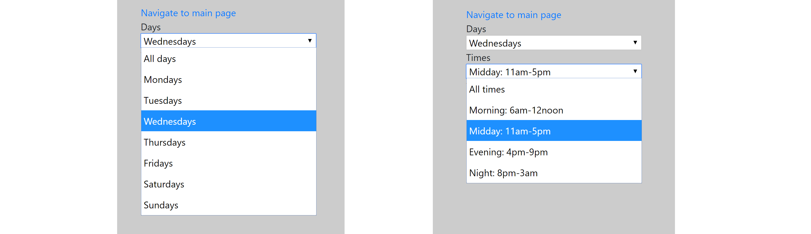
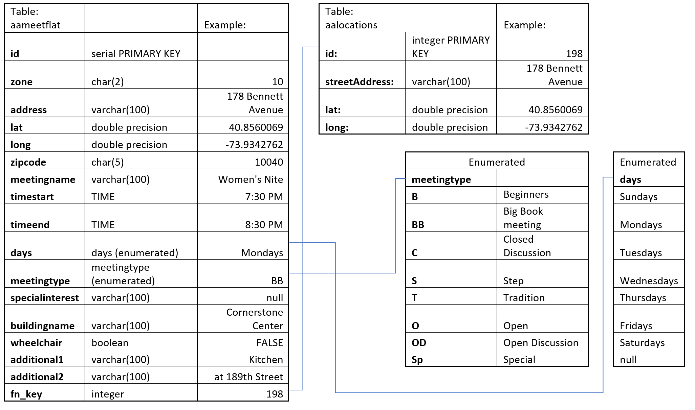
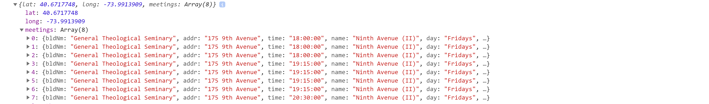

## Assignment 1: AA meetings

----------------------------

For all assignments go [to the main documentation page](https://github.com/acdreyer/data-structures/tree/master/finalAssignments).

----------------------------

#### 1. Introduction


The AA meeting project weekly assignments are spread over various weeks
and are briefly summarized below for reference:

* [Week 1](https://github.com/acdreyer/data-structures/tree/master/wAssignment_01):
Extract the body html from online webpages.
* [Week 2](https://github.com/acdreyer/data-structures/tree/master/wAssignment_02):
Parse through one of the pages to extract meeting address data.
* [Week 3](https://github.com/acdreyer/data-structures/tree/master/wAssignment_03):
Geocode each address and store in a JSON file.
* [Week 4](https://github.com/acdreyer/data-structures/tree/master/wAssignment_04):
Create an AWS PostgreSQL database and store AA meeting data therein.
* [Week 6](https://github.com/acdreyer/data-structures/tree/master/wAssignment_06):
Query data from the database.
* [Week 7](https://github.com/acdreyer/data-structures/tree/master/wAssignment_07):
Go back to the original AA meeting html files and now exctract all data from
all the AA meeting pages (previously it was done only for one).
* [Week 10](https://github.com/acdreyer/data-structures/tree/master/wAssignment_10):
Create a web application to connect server-side responses from client-side requests.
* [Week 11](https://github.com/acdreyer/data-structures/tree/master/wAssignment_11):
Do the visual framework design for the final webpage.


#### 2. User Interface and Navigation

The user interface consists of a dashboard with the main vieport and a navigation/selection
sidebar. 

A meeting is defined as the gathering of people at a specific time and place, hence
the map shows the locations and the navigation section the times and dates. This is 
the minimum information deemeded to be required by the user, although additional
details will be given in the map marker popup menus.

The main viewport contains a map that is powered by Leaflet and contains the
location markers for selected meeting locations. The map view is limited to Manhattan
with a generous border in order to maximize user experience.

Each marker represents a location that is tied to specific street address
and set of Geo location coordinates. Multiple meetings occur at specific locations,
hence meeting days and times are bound to the markers. Only markers
for selected filtered meetings are shown on the map. This is to aid user navigation
and performance. The additional meetings details will only be shown once the user has
selected the specific location. 
An additional information block is located below the navigation menus to show 
how many meetings were found. Meeting type keys are also supplied. In future
this space can be used for additional meeting details and/or selection filters.
A more detailed discussion on meeting filtering is given below. 


The navigation sidebar allows for user filtering meeting data on day and time.
Only meetings that occur on the selected days and starting in the selected time
brackets are shown on the map. However, the user is given the ability to also
show all days and all meetings, which will populate the whole map.




If specific hourly times were used, a scenario could occur where the user could select a time where no meetings 
are present, hence meeting time ranges were used instead, where meeting times
are grouped into "All times", "Morning", "Midday", "Evening" and "Night" in 
a similar way than the official Alcoholics Anonymous page does. 
The associated time ranges for each time category was used from the official
AA page. It is envisioned that having time groups will ensure
that there will always be meetings found by the user and the user won't get 
into a scenario of facing an empty map. 
The downside is that when the user selects all times for all days, some marker 
popups might be oversized, in which case the user has to make a filtered selection.


#### 3. Selection and Query


##### Database structure

During development and parsing all ten meeting zones it was found that some locations have
significantly more meetings per location than the Zone 7 locations that the initial 
flat database structure was based on, hence the overall database structure was
was revised to include the meeting location in a separate
relational table. The geolocation data was still kept in the main table in order to 
allow for development flexibilty, hence a hybrid database structure was used.
This  redundancy of storing geo coordinates and location addresses twice was deemed a small price to pay
for the increased flexibility during development and was not deemed to adversely
affect the current dataset. However, if the database needs to be upscaled in future it should
be considered to revise the use of redundant coordinates from the main table to improve storage
efficiency.



The data categories of days and times were chosen as main selection variables 
since these are expected to be the main user interest. *Meeting days* were used as an *enumerated list*, 
which is a PostgreSQL optimized selection category and requires little
additional query complexity during development. This is also likely much better
than storing day names as strings, which could have lower search performance.

Meeting types were also chosen as an an enumerated data type, but is currently not used to filter meetings. 
Rather the key is given as a static lookup table to save space in the popup menus. Meeting type 
is deemed a secondary parameter of interest and was given lower priority in display and interactivity.
This can be added as an interactive feature in future if required.   
In hindsight an additional data column of enumerated time categories of morning, midday,
evening and night could also have been added to increase database performance,
but this could be considered for a larger system in future.


##### Query Implementation


The user selection filter was implemented using an event listener on the dropdown
menu changes that call the `populatedoc(keepday, keeptime);` function.
The parameters "keepday" and "keeptime" keep track of the user selection
and also facilitates the default view when the page loads. With some experimentation
it was found that all markers can be included in the default view without any
decrease on performance, however it is recommended to test this performance with slower
internet connections. If performance is degraded it would be advisable to switch the 
default display to a single day by simply changing the 
"keepday" variable to the current day and the "keeptime" to the current (or next time) period.
This would be easily implemented by just updating the `keepday` and `keeptime` 
variables.

The dropdown menu parameters are selected as follows:

```
$(document.body).on('change', "#dayDropdown", function() {
    keepday = this.value;
    allmarkers.clearLayers();
    populatedoc(keepday, keeptime);
    });
```

Note that markers are added to layers and removed first using `allmarkers.clearLayers();`
before the server response function is called. 
This ensures that the map is always clean before adding new markers
and keeps the page lightweight.

Data is then obtained from the server using the AJAX `get` method that passes
the data parameters as part of the query string using
` $.get('/aameetings', { day: keepday, time: keeptime }, function(data) {`.
The AJAX call is used to only update the data that is relevant for the curren display.


#### 4. Response and Content Display

On the server side the query parameters are process in `if` statements to determine the 
days and time ranges of interest to construct the database query strings. This
technique of constructing query strings seems fairly laborious, but was deemed necessary
in order to correctly handle the `SELECT *` statement in case all meetings and/or times
are selected. Furthermore it was also needed to corrrectly handle AM times.
An extract of the query logic is given as

```
if (req.query.time) {
    meettimesSelect = req.query.time;
    if (meettimesSelect == "morning") {
        timestart = '6:00 AM';
        timeend = '12:00 PM';
    }
    ...
```

A secondary function is then called to keep code clean using `getAAmeetingresults(meetdaysSelect, meettimesSelect, req, res);`.

An example of the resulting query string construction is as follows:
```
var aameetingQuery1 = "SELECT lat, long, json_agg(json_build_object('bldNm', buildingname, 'addr', address, 'time', timestart, 'name', meetingname, 'day', days, 'typ', meetingtype, 'wch', wheelchair)) as meetings\
FROM aameetflat WHERE days = '" + meetdaysSelect + "' AND timestart >= '" + timestart + "' AND timestart <= '" + timeend + "' GROUP BY lat, long;";
```
This query aggragates meeting locations using 
`json_agg(json_build_object(...)) as meetings FROM ... WHERE ... GROUP BY lat, long;"`,
which results in a JSON structure that is compact for transmission from the server.
The resulting data is sent with the command `res.send([aares.rows.length, aares.rows]);` 
to include the amount of meetings as well as the resulting JSON data. The length
is included for the sake of convenience to show the amount of meetings found and
to cross-check data integrity during development. 
The client-side data structure for each geo location looks as follows:




The street address, building name and wheelchair access
data is added directly to the page, whereas meeting specific information is tabulated using 
a handlebars templating system to create an html table to be bound to the marker popup.
The template inside the html file is included as a script:

```
<!--create handlebars template for populating meeting data-->
<script id="small-template" type="text/x-handlebars-template">
    <table class="table">
        <thead>
            <th>Meeting name</th>
            <th>Times</th>
            <th>Days</th>
            <th>Type</th>
        </thead>
        <tbody>
            {{#each this}}
            <tr>
                <td>{{name}}</td>
                <td>{{time}}</td>
                <td>{{day}}</td>
                <td>{{typ}}</td>
            </tr>
            {{/each}}
        </tbody>
    </table>
</script>
```
The template is compiled using

```
var small_source = $("#small-template").html();         //handlebars source
var small_template = Handlebars.compile(small_source);  //handlebars template
```

Finally the data is bound to relevant Leaflet marker layer popups by first
creating a marker layer `let allmarkers = L.layerGroup().addTo(mymap);` and then
adding each location to the markers with the relevant popup data using the handlebars
templating system. An improvement could be to only add the data to markers when markers
are clicked by the user and only then query the data, however the performance of this 
current method was found to be adequate.

```
L.marker([data[1][i].lat, data[1][i].long])
        .bindPopup("<h6>" + data[1][i].meetings[0].addr + 
        "</h6><h6>" + data[1][i].meetings[0].bldNm + 
        "</h6>" + small_template(data[1][i].meetings) + 
        "<p><strong>" + data[1][i].meetings[0].wch + "<strong></p>")
        .addTo(allmarkers);
```

It was found that the use of layers greatly improves functionality and allows to 
easily remove marker layers for updates. This saves the page from being reloaded 
and only markers with relevant filtered details are added.


It is most likely possibly to gain much more functionality and/or performance if meeting details
and marker layers are used more creatively. This would be something worth exploring if the
system is scaled, since the user could possibly tap into filters that make different meeting
time ranges and/or categories different colors and/or pre-loading data to other marker layers
and only showing these when the user switches them on. Hence marker layers are deemed 
a useful tool if significant data needs to be added in future.


#### 5. Conclusion

The PostgreSQL data storage and retrieval was successful in the sense that it allowed
for a structured and efficient approach of storing and retrieving data. However,
some added flexibility was anticipated to be beneficial, hence a hybrid table was used with location
data in a relational table, but geolocation and addresses also stored in the main table.
This resulted in some storage redundancy, which had no noticable effect on storage limitations 
with the current data set. 

Ahybrid databasse allowed for greater flexibility in testing
and development, as well as to compare performance during testing. It is recommended to test the performance on slower
internet connections as well. If the database size is increased in future, additional consideration
could be considered to group time categories into enumerated lists to facilitate selection on time groups
rather than the database scanning through individual times.


The application running for assessment is located at:
[http://34.203.246.48:8080/final1_aameet.html](http://34.203.246.48:8080/final1_aameet.html)


<!--Some questions that may arise as you bind the data to the end-user interface:-->
<!--What information does the end user need? How? Why?-->
<!--From the data on AA's meeting list, which data is relevant for display in this project? How should it be displayed?-->
<!--What does a map marker represent? A meeting group? A meeting? A location?-->
<!--What is the minimum amount of data that can be queried to provide the necessary data for the visual representation?-->


<!--Your work will be assessed on:-->
<!--The integrity of the data-->
<!--The integrity of the database-->
<!--The efficiency of the queries and page load-->
<!--The choices of data structures-->
<!--The inclusion of relevant data-->
<!--The coherence and organization of your code and repository-->
<!--The method for binding the data to the visual representation-->


