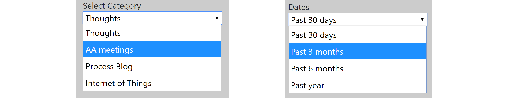
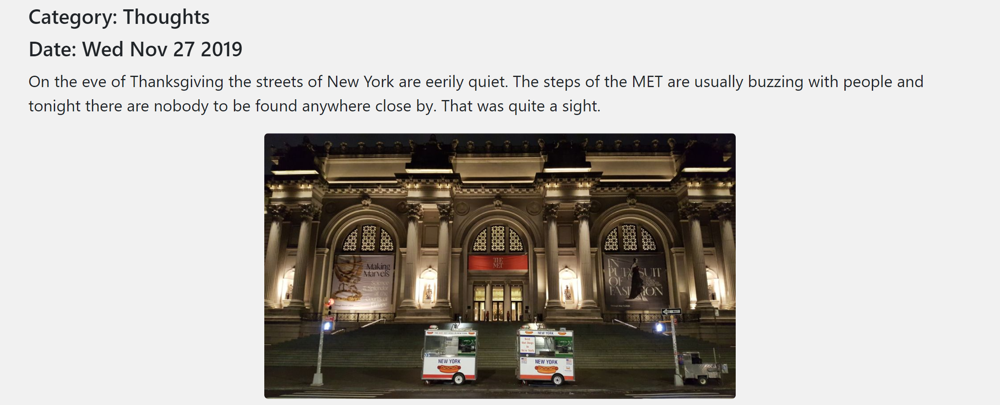

## Assignment 2: Process blog
----------------------------

For all assignments go [to the main documentation page](https://github.com/acdreyer/data-structures/tree/master/finalAssignments).

----------------------------

#### 1. Process Blog Introduction:

The Process Blog weekly assignments are briefly introduced, after which the final 
assignment details are supplied:

The weekly assignment details are found in:

* [Week 5](https://github.com/acdreyer/data-structures/tree/master/wAssignment_05):
Create an AWS DynamoDB NoSQL database and start storing process blog data.
* [Week 6](https://github.com/acdreyer/data-structures/tree/master/wAssignment_06):
Query data from the database.
* [Week 10](https://github.com/acdreyer/data-structures/tree/master/wAssignment_10):
Create a web application to connect server-side responses from client-side requests.
* [Week 11](https://github.com/acdreyer/data-structures/tree/master/wAssignment_11):
Do the visual framework design for the final webpage.


#### 2. Process Blog User Interface

Two main types of information are required by the user:
- information to navigate the blog entries 
- the blog entries themselves

Abovementioned implied splitting the browser window into two sections; a main 
window showing the article/blog information and a sidebar that includes navigation
elements. There is space left below the navigation elements for future page growth.


#### 3. Process Blog Navigation and Query


The AWS DynamoDB allows sorting and searching only through the primary and sort keys, 
hence these are the only handles available between the user and the database.
The front-end navigation is therefore based on the
chosen primary key of `Category` and the associated sort key of `Date`. 
Using these keys the user is given navigation access to filter the blog entries
using "category" and "date" drop-down menus.





Whereas it might theoretically be possible for the user to filter blogs by searching through individual days, 
the amount of blog entries are relatively sparse and it made sense to navigate through longer 
date ranges for a more user friendly experience.
Subsquently of date ranges of the
`Past 30 days`, `3 months`, `6 months` and `1 year` were chosen, with the default view
being `Past 30 days` and the category `Thoughts`. This view is to facilitate quick loading
that will have at least one blog entry, but not too many which will take longer to load. 
The primary category was also chosen as "Thoughts"
and is not directly focused on any of the projects. This aims to make it more clear to the 
user that this page is a blog and not any of the other "project websites".

User input is obtained from the drop-down menus using JQuery with an 
event listener that calls a function as follows:

```
$(document.body).on('change', "#categoryDropdown", function() {
    keepCat = this.value;
    populatedoc(keepCat, keepRange);
});

```

This sends a `get` request to the server using AJAX as follows, with the
query parameters of `category` and `dtrange` in the query string:

```
$.get('/processblog', { category: keepCat, dtrange: keepRange }, function(data) {
    var htmlposts = small_template(data);
    $('#maincontentarea').html(htmlposts)
});
```
The server employs if statements to assign a DynamoDB query start and end date with the Javascript `moment.js`
library; with `endDate = moment();` and `startDate = moment().subtract(1, 'months')`.


#### 4. Process Blog Response and Content Display

Since the user will likely want to read latest content first,
the blog entries are sorted and returned in *descending order* by including the `ScanIndexForward: false`
parameter in the DynamoDB query object. This allows the user to see the latest entry first
and scroll down toward older entries.

```
var params = {
    TableName: "processblog",
    KeyConditionExpression: "#ct = :category and dt  between :minDate and :maxDate", // the query expression
    ScanIndexForward: false,    // true = ascending, false = descending
    ExpressionAttributeNames: { // name substitution, used for reserved words in DynamoDB
            "#ct": "category"
    },
    ExpressionAttributeValues: { // the query values
        ":category": { S: req.query.category },
        ":minDate": { N: startDate.valueOf().toString() },
        ":maxDate": { N: endDate.valueOf().toString() }
        }
    };
```


The data is sent from the server to the client as an object that includes and array of objects.
This object with an array of objects is structures to facilitate compiling on the client-side 
using the [Handlebars.js](https://handlebarsjs.com/) templating system.


```
output.blogpost = [];
data.Items.forEach(function(item) {
    output.blogpost.push({  
        date: item.dtstring.S, 
        category: item.category.S, 
        content: item.content.S,
        filename: item.imageurl.S,
        tags: item.tags.SS,
        iwentto: item.iwentto.SS
    })
});
```

Hence no additional html is sent to the client, but only the filtered list of blog posts. 
The data is then compiled on the client side using a `handlebar` template. 
Sending only the data from the server without additional html is deemed more efficient 
than compiling the html and data on the server and sending the full html, since 
a lot of the html text with div tags are repeated information that can be kept separate
from the data. Although, it should be mentioned that a further future improvement could include
precompiling a handlebar template separately to save the client-side from having to 
compile the template and merge the data, in which case it would only have to merge the template 
with the data on the client side.


```
{{#blogpost}}
  <div class="col-xs-4">
    <div class='post'>
      <h5>Category: {{category}}</h5> <h5>Date: {{date}}</h5>
      <p>{{content}}</p>  
<div class="blogimage">

</div>
    </div>
  </div>
{{/blogpost}}
```

The resulting html is as follows:


Images were also included in all the blog posts, but these were not sent from the server-side
as part of the blog entry data. Low resolution images are served from the public folder
and only image file names are sent as part of the database query. 
As the user loads a set of blog posts, 
the browser automatically downloads these from the public folder. 
This save the client from loading all the images at once. 
The blog post are then displayed each in its own content `<div>` element as follows:




#### 5. Progress Blog Conclusion:

The process blog was likely the least challenging of the three assignments due to 
the flexible nature of the DynamoDB database. Managing changes in the database
was significantly easier than the PostgreSQL database and it was found to be
especially useful to have the AWS GUI web interface to manually delete and/or
update individual records. However, the added flexibility did come
at a price, because only the primary key (and associated sort key) can be used
to query data.
The database is relatively easy to maintain.


The application running for assessment is located at:
[http://34.203.246.48:8080/final2_processblog.html](http://34.203.246.48:8080/final2_processblog.html)

<!--Your work will be assessed on:-->
<!--The integrity of the data-->
<!--The integrity of the database-->
<!--The efficiency of the queries and page load-->
<!--The choices of data structures-->
<!--The inclusion of relevant data-->
<!--The coherence and organization of your code and repository-->
<!--The method for binding the data to the visual representation-->


