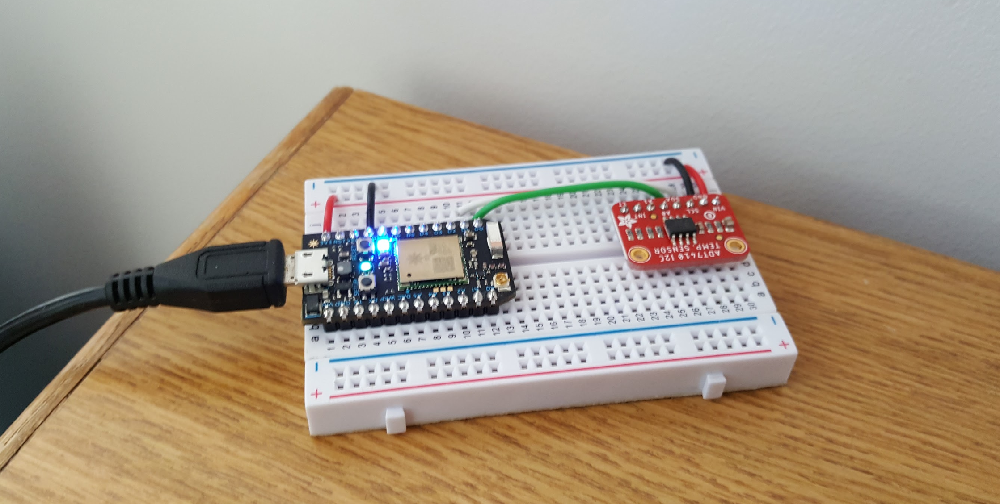
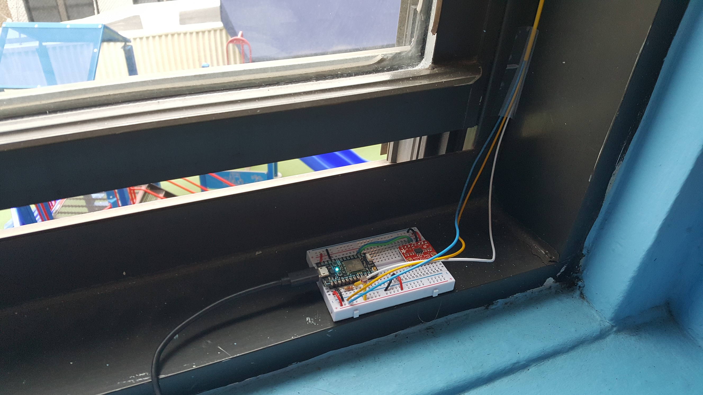
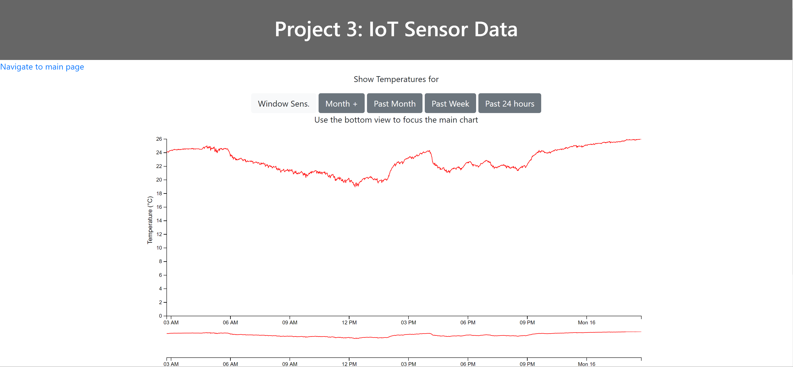
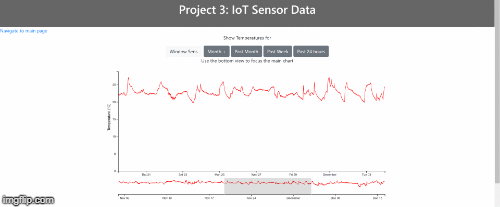
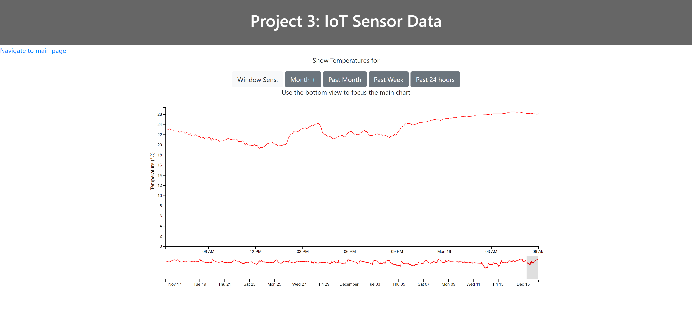
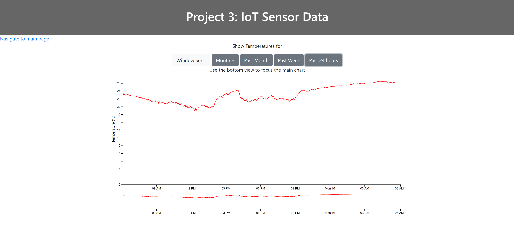
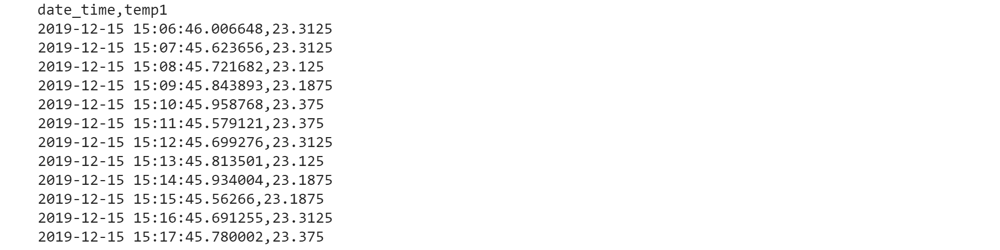

## Assignment 3: IoT Temperature Sensor
--------------------------------------

For all assignments go [to the main documentation page](https://github.com/acdreyer/data-structures/tree/master/finalAssignments).

-------------------------------------

#### 1. IoT Sensor Introduction

The IoT temperature sensor project builds on the previous weeks' work. 
At first these are summarized and then the final assigment detail are given:

<!--https://github.com/acdreyer/data-structures/tree/master/wAssignment_08-->

* Week 8: Build an Internet of Things circuit board to record ambient temperature data
and uploaded to the Particle.io cloud through wifi.
* [Week 9](https://github.com/acdreyer/data-structures/tree/master/wAssignment_09):
Store temperature data in an AWS PostgreSQL database.
* [Week 10](https://github.com/acdreyer/data-structures/tree/master/wAssignment_10):
Create a web application to connect server-side responses from client-side requests.
* [Week 11](https://github.com/acdreyer/data-structures/tree/master/wAssignment_11):
Do the visual framework design for the final webpage.

Details of the temperature sensor setup is described in previous weekly assignments,
but additional work was done to add additional sensors.
The main sensor was still kept on a desk to log core baseline data as part of the main
assignment requirements.




Another Particle electron board was added at a later stage to supplement the main
sensor and data set. Various sensors were experimented with, but some core issues emerged
* Using analogue TMP36 temperature sensors were problematic and it might have been due
to Electromagnetic interference on unshielded signal wires. However, even after
a filter capacitor was added, problems remained.
* Analogue sensor data might have been affected by impedance effects on the 
microcontroller switching. Additional investigation would have been required,
but it falls beyond the scope of this project.

Subsequently three additional sensors were added to the window sensor board.
These were logged to a separate database table and include the sensors:
* Another digitial temperature sensor (ADT7410).
* A Hall effect magnetic sensor to check if the window is fully closed (U58602).
This works with a magnet on the window mechanism.
* A photoresistor (PDV-P8001) to measure light intensity.

Due to lack of calibration equipment and the existance of analogue 
voltage sensing discrepancies, the both the Hall effect (magnetic) sensor
and light sensor are used as unitless qualitative indicators.

The window sensor board (temperature and light sensor):


The window magnetic sensor (window fully closed):


#### 2. IoT Sensor User Interface


A line graph was chosen to visualize the IoT temperature sensor data in **degrees Celcius**.
The user interface was subsequently optimized for horizontal space,
since it was anticipated that the graph would require more space horizontally than 
vertically. This is partially because initial temperatures were have low levels of fluctuation.

A user interaction section was required to allow the user to filter historical data
based on user interest. The default view is data for the past day (24 hours), since
this allow a quick page load with the latest information, which is of most interest
and also short duration for a quick response.





Buttons were added for the past **24 hours, the past week, month and "month +"**.
The range for *"month +"* allows
for visualizing data that is more than a month old. Depending on how long the period is 
that the sensor logs data, this "month +" could become a consideration for scalability, 
since longer datalogging times will increase the total amount of data and
require additional filtering/query subsampling modifications to keep data througput
from the server the same and not to affect the response time and user experience.
This topic is addressed in greater detail below.

A secondary interactive brushing tool was also added below the main graph to allow
the user to zoom into a certain time/date range of interest.
This tool is also deemed useful to investigate the effects of subsampling data 
points and investigate the effect of sampling rate and aggregation, hence
it was included for both development purposes and for increased functionality
for user interaction.




#### 3. IoT Sensor Navigation and Display


The buttons on the top of the page each call the same `getdata()` function when
clicked, albeit each sending different parameters to the server. The grey buttons pass the string 
parameters "day", "week", "month" and "year" together with the sensor parameter
"one" for the single main IoT sensor. The more subtle Window Sensor button
sends the string "all" to indicate a request for the extra window sensors.
A subtle styling was used on the Window sensor button since additional sensors
are not the main focus of the project.

The duration and sensor parameters are then passed as query parameters to a `$(get)` AJAX call to the 
server application using `$.get('/sensor', { duration: period, sensortype: whichsensor }, function(data) {...`

The server then handles the request by using if statements to select which sensors and date
ranges to request from the database:

```
if (req.query.sensortype == "all") {
    getsensordatamany(req.query.duration,"all",req,res);
}
else if (req.query.duration == "day") {
    getsensordata("day","one",req,res);
}
else if ...
```


#### 4. IoT Sensor Data Throughput optimization

Two main ways were employed to optimize data throughput from the server,
reduce the response time and increase the user experience:
- Reducing sampling rate at longer requested date ranges
- Restructuring the server data rows from an object to an array to exclude object key names.


##### Reducing sampling rate

If the data is queried for a month or longer a noticable decrease in response time occured,
hence data sampling was reduced as part of the server-side processing. In order to do this, the
database query was ampended to extract datapoints from every 5 minutes instead of 
sending the data as it was recorded every minute.
The query string to do this includes the command of 
`extract(epoch from date_trunc('minute', DBtime))::int % (5*60) = 0`
which uses the modulus operator to create a subset of the data. 
This effectively reduces the amount of data by 80% and results
in a significant increase in performance. More specifically it allows the
user experience to remain unchanged when extracting longer time ranges.
The full query is given below:

```
var sensorQuery3 = "SELECT array_to_string( \
                    ARRAY(WITH t AS (SELECT * FROM particlewave WHERE \
                    extract(epoch from date_trunc('minute', DBtime))::int % (5*60) = 0 AND\
                    DBtime BETWEEN now() - INTERVAL '1 "+ period +"' AND now()  ) \
                    SELECT DBtime || ',' || tempsensor  FROM t ORDER BY DBtime ASC), '\n ') AS tempsensdata ;";
```

The query effectively reduces the sensor sampling rate, but since there is so many more
data points on screen, the user will not notice any perceivable visual difference.
Only when using the brushing tool to zoom into a day range is some slight loss in 
resolution visible.

Below is the data for a month zoomed into the last day, which shows a gradual trend,
and compare this to the day values, which is slightly more noisy.

Month data zoomed into 1 day at 5min effective sampling:


Day data at 1min sampling:



##### Restructuring server response data

The second method to decrease the amount of data communication between the server
and the client was to restructure the database response from the PostgreSQL
database rows by dropping the object key/value names.

It was observed that the standard response from the PostgreSQL database
was an object that includes object key/value pair for each datapoint and since these are
all the same, the names are redundant and it does not make sense to pass this from the server to the client.
Hence a csv-type array was used that only contain the sensor temperature and time
values using `SELECT array_to_string( ARRAY( ... ), '\n ') AS tempsensdata ;` with 
a header that was custom constructed. This format allowed use of the D3 CSV
tools to reconstruct the data on the client-side for plotting.
A console log shows this data structure to reduce all communicated data:




##### Adding more sensors

In order to do stress testing and investigate scalability, more sensors were
added to the visualization with a more subtle "Window Sens." button. 
This button allows the user to show sensor data from another IoT device that
was located at the window and gives wider ranging temperature values.

For this visualization all the values are plotted on the same axis system,
even though the hall effect and light sensor values serve only as a qualitative 
measure of window open/close status and light intensity level.
The light sensor was basically used to check if the temperature sensor was exposed to direct sunlight. 
The additional sensors conveniently gives some indication of scalability.

By employing the same subsampling technique as before, these sensors could be added without
any perceivable impact on user experience.
It is recommended to add these sensors to separate axes systems and merge 
the data tables from both temperature sensors onto one single chart.
This task was deemed beyond the scope of the current project.


#### 5. IoT Sensor Conclusion:

The IoT senor project was deeply insightful into the world of digital sensing,
storing and interfacing data from IoT devices. It seemed clear that
the PostgreSQL standard way of storing and retrieving pure numerical data has room
for optimization. Improvements were added by constructin custom queries that allowed:
- Increasing performance by reducing sensor sampling rate through server-side post-processing.
This was done by constructing custom queries for longr date ranges (a month and longer).
- Restructuring the standard table row output format to only inlclude numerical data and
adding data variable names once to a single header string.

A further method to improve data througput by storing numerical data in more optimized
binary format could possibly be considered for increased scalability (througput).

Scalabilty was shown by adding a secondary sensor board that has three sensors in total.
These were handled in the same way as the primary sensor, but simply adding more columns
to the data structure. The plot was handled in a similar way, althoug it is recommended 
to split the plotting window in future for different types of sensors, which would allow
each sensor to be plotted on its own separate axis system. This task falls beyond the scope
of the current project.


<!--Your submission should consist of:-->

<!--the URL where the visualization is running-->
<!--the URL of your (well-documented!) GitHub repository for this project, which should include:-->
<!--detailed written and visual documentation to provide context for your work, -->
<!--including specifics on how your endpoint data connects to each of the elements of your final interface design-->
<!--Your work will be assessed on:-->
<!--The integrity of the data (and successful gathering of at least four weeks of good data)-->
<!--The integrity of the database-->
<!--The efficiency of the queries and page load-->
<!--The choices of data structures-->
<!--The inclusion of relevant data-->
<!--The coherence and organization of your code and repository-->
<!--The strategy for binding the data to the visual representation-->
<!--Reliability, scalability, maintainability, and sustainability-->


