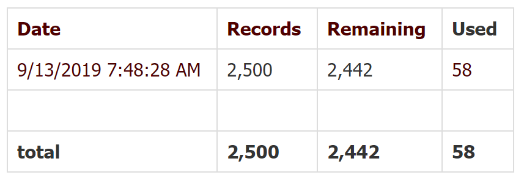
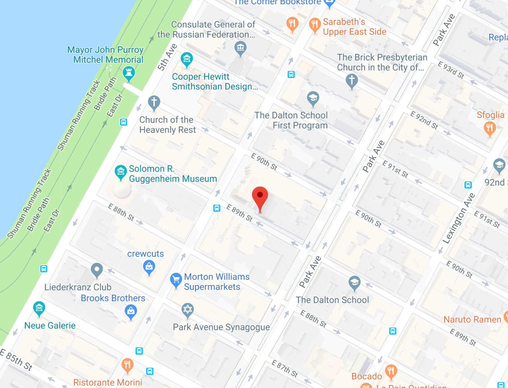

## MSDV PGDV5110 Weekly assignment 03 
(due 09/16/2019 6pm)

### Summary:

This task builds on the previous week's assignment by adding Latitude and 
Longitude data using [Texas A&M University (TAMU) Geoservices API](http://geoservices.tamu.edu/Services/Geocode/WebService/).

The code in this folder is intended to run in the Amazon Web Services (AWS) Cloud9 development environment.

### Documentation:

#### Introduction and Inputs:

The assignment is detailed in the [data structures course github page](https://github.com/visualizedata/data-structures/blob/master/weekly_assignment_03.md).

The addresses that were previously parsed from the AA meetings 
were used to obtain the Latitude and Longitude for each meeting location.
**Zone 7** was used the same as the previous week (i.e. a single zone file).

Detailed code was supplied in order to interface with the TAMU API.

#### Description of details:

A main challenge of this week was to test code while making as few requests as possible to the 
TAMU API, since each TAMU user account only has 2500 free requests, after
which transactions will incur a fee.

Other aspects included setting up environment variables to keep the API key secret
and to format data correctly.

 
The amount of requests to the API was minimized through using a single initial API request of which 
the output was saved to a JSON (text) file. This file was again loaded and then used 
for debugging code without real TAMU API requests. Code was written such 
that variables could just be exchanged for the real API request.
After coding and debugging was completed, the static file reference was removed 
and API requests were uncommented.

The result was that only 5 API requests were needed in total for debugging purposes. 
After all Geolocations for all 53 meetings in Manhattan Zone 7 was completed only 
a total of 58 requests were used (see below). This low usage of API requests aims to 
give room for more API requests that might be required in the future when coordinates of
all other zones need to be determined.





An example of the TAMU output is given [in the assigment page](https://github.com/visualizedata/data-structures/blob/master/weekly_assignment_03.md):

Note that only some of the TAMU GeoService output sections are necessary. These included:
* **Latitude**: primary variable; decimal format.
* **Longitude**: primary variable decimal format.
* **TAMU Formatted street address**: to be used for data consistency checking (i.e. to compare with input).
* **Feature Matching Result Type**: `Success` is expected. In cases where multiple locations are possible, 
results could also include `ambiguous` or `brokenTie` (see [TAMU GeoServices API page](http://geoservices.tamu.edu/Services/Geocode/WebService/)). 
It was found that by adding the zip code to the API request input would remove instances of `brokenTie`. 
Subsequently zipcodes were included and all outputs had `Success` as the MatchingResultType.
* **Query Status Code Value**: Expected `200` for a successful output. [Other codes indicate problems](http://geoservices.tamu.edu/Services/Geocode/About/#QueryStatusCodes).
* **MatchScore**: Match percentage between input data and reference feature; 100% is a perfect match.

The following section of code was used to extract the data and store the relevant
identifiers in an object. Only the first geolocation was
used if for any reason there might have been multiple outputs (which is possible for imperfect matching). 

```
    TAMUnew = {
        lat: TAMUcontent.OutputGeocodes[0].OutputGeocode.Latitude,
        long: TAMUcontent.OutputGeocodes[0].OutputGeocode.Longitude,
        TAMUaddress: TAMUcontent.InputAddress.StreetAddress,
        MatchType: TAMUcontent.FeatureMatchingResultType,
        StatusCode: TAMUcontent.QueryStatusCodeValue,
        MatchScore: TAMUcontent.OutputGeocodes[0].OutputGeocode.MatchScore
    };
```

The object was then added to the main meeting object (to be stored in an array
of meetings).


#### Output:

The output was an ordered data set including the major aspects of the meeting 
information with GeoLocation data added. Data was stored in an array of objects, 
each including the following fields, with `GeoInfo` a new field as an object inside
the main object (see example below):

``` 
	{
		"streetAddress": "65 East 89th Street",
		"buildingName": "St. Thomas More Church",
		"meetingName": "CARNEGIE HILL - Carnegie Hill",
		"zipcode": "10128",
		"zone": 7,
		"descr1": "Basement",
		"descr2": "(@ Park &amp; Madison Avenues)  ",
		"GeoInfo": {
			"lat": "40.78259",
			"long": "-73.9566571",
			"TAMUaddress": "65 E 89TH ST New York NY 10128",
			"MatchType": "Success",
			"StatusCode": "200",
			"MatchScore": "100"
		}
```

A quick check was done on [google maps](https://www.google.com/maps/place/40%C2%B046'57.3%22N+73%C2%B057'24.0%22W/@40.78259,-73.9588458,17z/data=!3m1!4b1!4m5!3m4!1s0x0:0x0!8m2!3d40.78259!4d-73.9566571) to verify 
abovementioned address:




The meeting file was then store in a text file (JSON format).

This folder contains the following files:
* This README.md file
* The wAssignment_03.js code that does the API request and postprocessing.
* One zone7meetings.json file in the ./data subfolder (input).
* One **zone7meetingsGeo.json** files in the ./data subfolder (output). 
* One TAMUraw.json file (output); includes all output data from TAMU API.


#### Notes and dependencies

The code in this folder can likely be used by external users, 
but is intented to be run on Cloud9 where all dependencies for development is already available.
[async](https://caolan.github.io/async/v3/) and [dotenv](https://www.npmjs.com/package/dotenv) is required.

