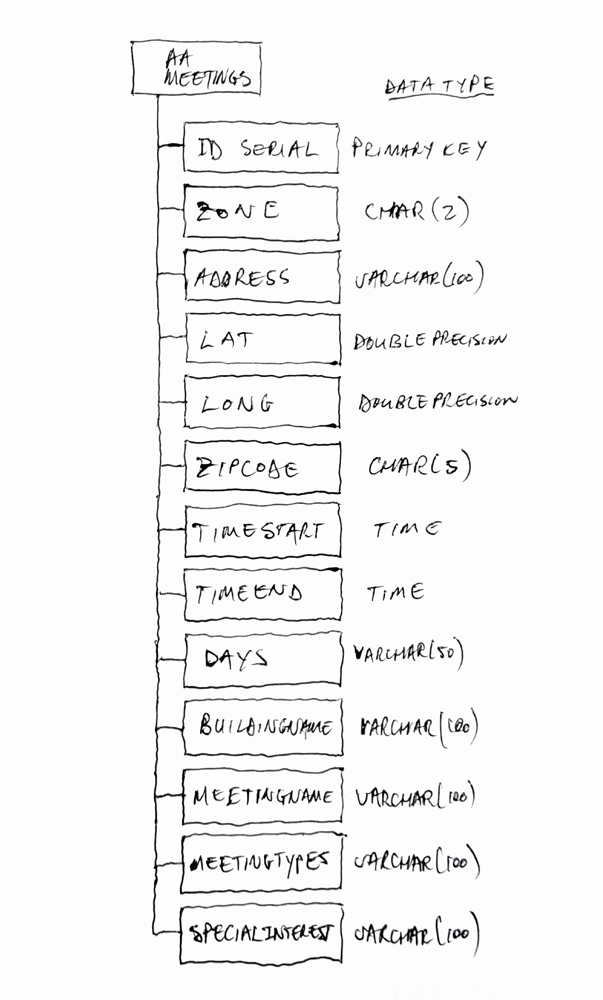
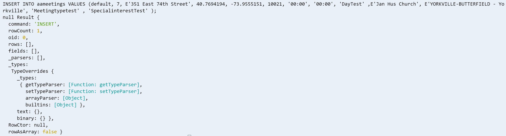
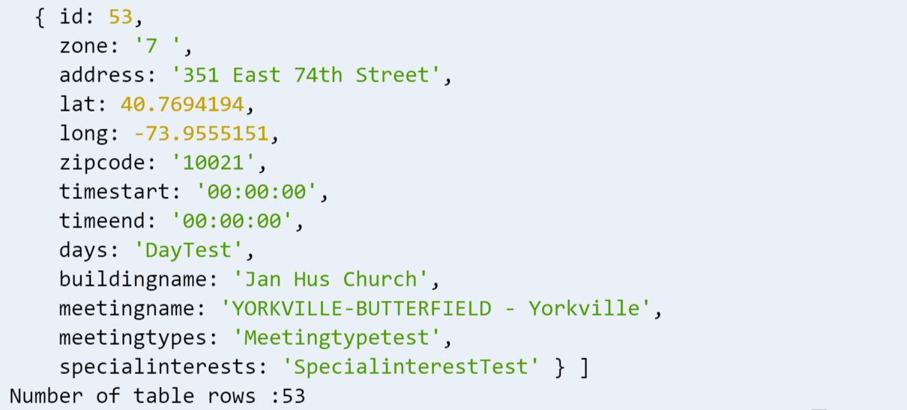

## MSDV PGDV5110 Weekly assignment 03 
(due 23/16/2019 6pm)

### Summary:

This task builds on the previous week's assignment storing data into a PostgreSQL
database on Amazon Web Services (AWS).

### Documentation:

#### Introduction:

The assignment is detailed in the [data structures course github page](https://github.com/visualizedata/data-structures/blob/master/weekly_assignment_04.md).

A detailed [instruction](https://github.com/visualizedata/data-structures/blob/master/weekly_assignment_04_documentation.md) 
was supplied to setup a PostgreSQL database on AWS.


#### Planning

The following questions required answers: 

1. Will you use a Normalized Data Model or a Denormalized Data Model? Why?


A Denormalized Data model was selected, because the data set is not significantly large
(approx 50-60 meetings across ten zones).
Storage requirements are adequate in AWS and the complexity to Normalize the data
would not be inline with fully normalizing the database at this time.
Whereas this choice might impact scalability (if for example the whole world AA 
meetings is needed), the duplication in the current model is deemed
to have a Denormalized model.


2. When the data comes back out of the database, how should it be structured? Why?

Data coming back from the database should be Normalized because browser 
performance would be negatively impacted by handling the full data set all at once.
Subsets of the table would be extracted and used locally in the browser, with
information only accessed as required.
This is especially true because subset queries should be manageble with this 
dataset. 

For example: Not all the meeting info would be used while populating the map
with marker, however when a single marker is highlighted, that particular point
would require additional information from the database.


3. How would you describe the hierarchy of the data?

A flat data structure was chosen without relations as indicated in the image below.




#### Process:

In order to create, read, update and delete the database, three node.js script 
files were used. The first was used to create and delete the database using
`CREATE TABLE` and `DROP TABLE` commands commented or uncommented.
The second file was used to update (using `INSERT INTO`) and the 
third file was used to read (using `SELECT * FROM`).

Since a flat structure was used, all commands were populated inline, using the following
variables and data types:

* **id**:	SERIAL PRIMARY KEY
* **zone**:	char(2)
* **address**: varchar(100)
* **lat**: double precision 
* **long**: double precision 
* **zipcode**: char(5) 
* **timestart**: TIME 
* **timeend**: TIME
* **days**: varchar(50) 
* **buildingname**: varchar(100) 
* **meetingname**: varchar(100) 
* **meetingtypes**: varchar(100) 
* **specialinterests**: varchar(100)

In order to make syntax editing manageble, four tables were created first, 
each focusing on a subset of variables. When each of these were completed, 
one big table was populated; using: `INSERT INTO aameetings ...`




#### Output:

The output is a data table in the AWS PostgreSQL database (see example below).
This shows only the last entry; with the number of rows logged out to verify 
all entries were added.

<!--``` -->
<!--  { id: 53,-->
<!--    zone: '7 ',-->
<!--    address: '351 East 74th Street',-->
<!--    lat: 40.7694194,-->
<!--    long: -73.9555151,-->
<!--    zipcode: '10021',-->
<!--    timestart: '00:00:00',-->
<!--    timeend: '00:00:00',-->
<!--    days: 'DayTest',-->
<!--    buildingname: 'Jan Hus Church',-->
<!--    meetingname: 'YORKVILLE-BUTTERFIELD - Yorkville',-->
<!--    meetingtypes: 'Meetingtypetest',-->
<!--    specialinterests: 'SpecialinterestTest' } ]-->
<!--Number of table rows :53-->
<!--```-->



#### Notes and dependencies

The is intented to be run on Cloud9 where all dependencies for development is already available.
[async](https://caolan.github.io/async/v3/),  [dotenv](https://www.npmjs.com/package/dotenv) and 
[pg](https://node-postgres.com/) is required.

