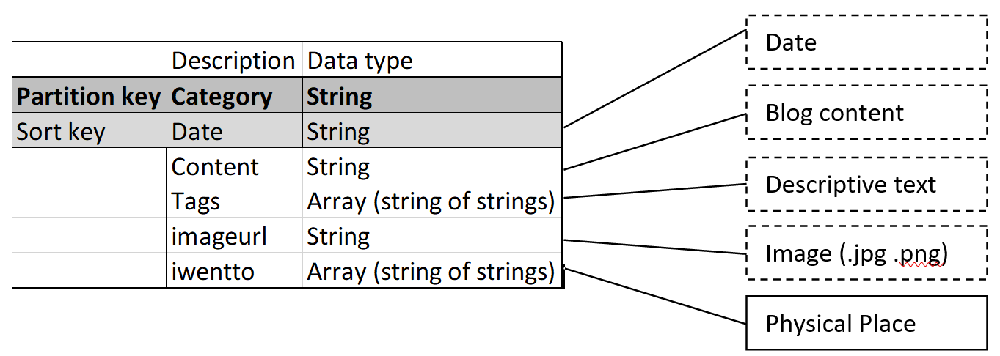
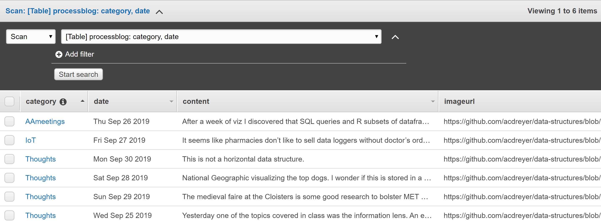

## MSDV PGDV5110 Weekly assignment 05 
(due: 10/01/2019 9am)

### Summary:

This task consists of storing process blog data in an AWS dynamoDB database.

### Documentation:
--------------------------

#### Introduction:

The assignment is detailed in the [data structures course github page](https://github.com/visualizedata/data-structures/blob/master/weekly_assignment_05.md).


#### Planning

The following questions required answers: 

1. Will you use a Normalized Data Model or a Denormalized Data Model? Why?


A Denormalized Data model is used.
The dynamoDB database makes it easy to store any type of data and it can be organized
fairly simply by using the Primary (Partition) key and Sort key. 
As long as these keys are chosen in a way that would make access easy in future,
there doesn't need to be additional relations added.
Data will also be more accessed than written, hence the traffic requirement
is expected to be relatively low.


2. When the data comes back out of the database, how should it be structured? Why?

Data coming back from the database will stay denormalized.
The fields that are repeated does not make significant impact on storage requirements
and it wouldn't make much sense to normalize the data considering the trade-off
between complexity and storage.


3. How would you describe the hierarchy of the data?

A flat data structure as indicated in the image below.




---------

#### Process:

A dynamoDB table was created in AWS. The object constructor was 
implemented with main code of interest shown below.


* `this.category.S = category.toString();`
* `this.date.S = new Date(date).toDateString();`
* `this.content.S = content;`
* `this.tags.SS = tags;`
* `this.imageurl = {};`
* `this.imageurl.S = imageurl;`
* `this.iwentto.SS = iwentto;`

An example of the resulting blog entry is as follows:

```
BlogEntry {
  category: { S: 'Thoughts' },
  date: { S: 'Mon Sep 30 2019' },
  content: { S: 'This is not a horizontal data structure.' },
  tags: { SS: [ 'structure' ] },
  imageurl:
   { S:
      'https://github.com/acdreyer/data-structures/blob/master/wAssignment_05/images/20190930_structure.png' },
  iwentto: { SS: [ 'Columbus Circle' ] },
  month: { N: '8' } }
```


#### Output:

The resulting table in AWS is shown here:




#### Notes and dependencies

The is intented to be run on Cloud9 where all dependencies for development is already available.
[async](https://caolan.github.io/async/v3/) and [aws-sdk](https://docs.aws.amazon.com/AWSJavaScriptSDK/latest/) are required.

