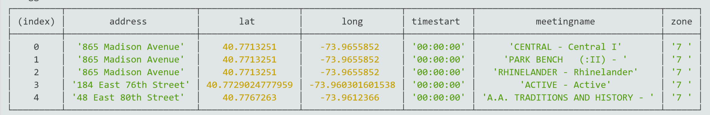
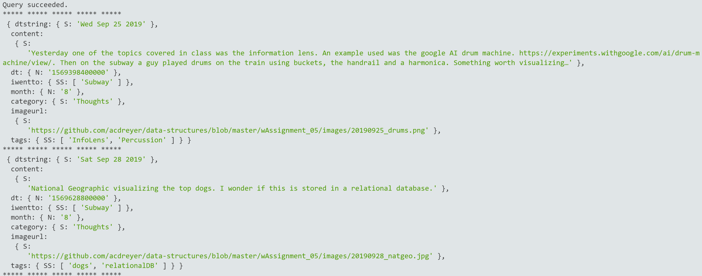

## MSDV PGDV5110 Weekly assignment 06 
(due: 10/14/2019 6pm)

### Summary:

This task consists of database queries broken into two parts:
1. PostgreSQL queries of AA meeting data
2. AWS dynamoDB database queries of the process blog.

The assignment is detailed in the [data structures course github page](https://github.com/visualizedata/data-structures/blob/master/weekly_assignment_06.md).

--------------------------

### Documentation:

1. PostgreSQL Query:

The PostgreSQL is constructed assuming the meeting time would be needed. 
Additionally a browser window will need to be populated with filtered 
latitudes and longitudes wherein meeting locations will be shown.

The flat database structure allowed for simple queries. It is recommended to 
evaluate query performance once the full dataset with all 10 zones is 
populated (see following [assignment](https://github.com/visualizedata/data-structures/blob/master/weekly_assignment_07.md)). 
Additional `GROUP BY` sections might then have to be added to aggregate
data. Parsed times should also still be added to the database table.

The following code was used to select a window for a specified min. latitude and
specified maximum longitude. This query will be more involved for the final project: 

```
var thisQuery =     "SELECT address, lat, long, timestart, meetingname, zone \
                    FROM aameetings \
                    WHERE timestart = '00:00:00' and lat >= 40.7697705 and long <= -73.960301601538 \
                    ORDER BY lat ASC, long DESC;";
```

The output is shown below:




2. DynamoDB Query:

The DynamoDB query required some re-evaluation of the original database sort key.
Even though it is possible to do matching on a string it was decided to rather
convert the date sort key to a number (Unix Epoch time) to facilitate easy 
sorting. This implies the date always has to be converted to a number first to 
do the query. It is fairly simple to convert the epoch time back to a human-readable
date, but since few restrictions hold on the dynamoDB database (and this is a 
small dataset), an additional human readable date field was created. This is 
deemed useful for debugging purposes and could possibly be dropped in future if 
an epoch converting function is added.

The query is done with the following values:

```
    ExpressionAttributeValues: { // the query values
        ":category": {S: "Thoughts"},
        ":minDate": {N: new Date("Sep 25 2019").valueOf().toString()},
        ":maxDate": {N: new Date("Sep 29 2019").valueOf().toString()}
    }
```

The output is shown below:




#### Notes and dependencies

The is intented to be run on Cloud9 where all dependencies for development is already available;
[aws-sdk](https://docs.aws.amazon.com/AWSJavaScriptSDK/latest/), 
[dotenv](https://www.npmjs.com/package/dotenv) and [pg](https://node-postgres.com/) are required.

