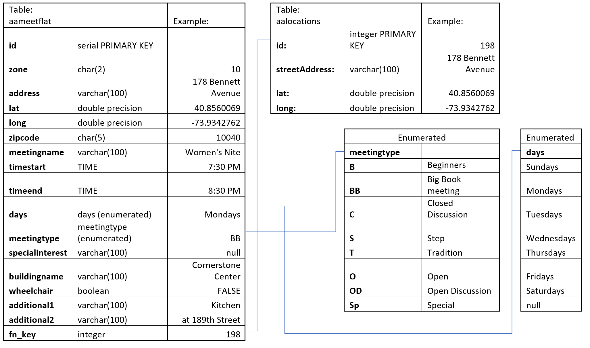
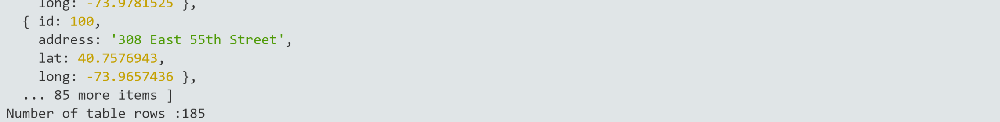
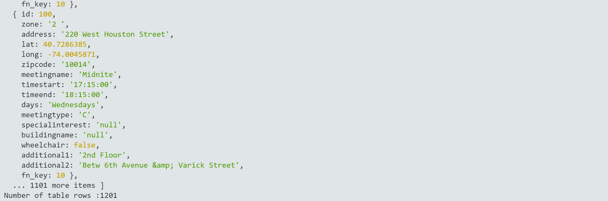

## MSDV PGDV5110 Weekly assignment 07 
(due: 10/21/2019 6pm - extended 10/26/2019 6pm)

### Summary:

This task consists of going back to previous weeks and cleaning all ten zones
of the Manhattan AA meeting data. The core of the tasks are summarized herein, but
more details can be found in the code.

The assignment is detailed in the [data structures course github page](https://github.com/visualizedata/data-structures/blob/master/weekly_assignment_07.md).


### Documentation:
--------------------------

1. Parsing all the zone data:

[Week 02](https://github.com/acdreyer/data-structures/tree/master/wAssignment_02)
was revisited by firstly re-parsing AA meeting data for zone 7 
to extract additional information such as meeting times, days, types and wheelchair access.
Since the .html table structure was processed in rows and then columns, the section on
meeting time details could be extracted from iterating through the columns. 

Then all meeting zones were parsed methodically by doing each zone individually
to avoid oversights or missing data.
Care was taken to log lines are not used which might contain data in 
[log files](https://github.com/acdreyer/data-structures/blob/master/wAssignment_02/data/)
for each zone, such for [zone 7](https://github.com/acdreyer/data-structures/blob/master/wAssignment_02/data/logfileZone07.txt),
which shows for example:
```
Row 43 excluded data: </b>
Row 43 moved data: Church of the Good Shepard
```

Only major corrections were logged to log files, other corrections were implemented case-by-case
basis programmatically throughout the process. These corrections are visible in the code.

In order to verify addresses, these were also written out to CSV files for each zone in order
to inspect any errors (e.g. [zone 7](https://github.com/acdreyer/data-structures/blob/master/wAssignment_02/data/zone07meetingsCSV.txt)).

```
Address,City/State,Zipcode 
351 East 74th Street,NY,10021
48 East 80th Street,NY,10021
184 East 76th Street,NY,10021
...
```

The full code for cleaning the data is given in 
[wa_02b_cleandata.js](https://github.com/acdreyer/data-structures/blob/master/wAssignment_07/wa_02b_cleandata.js)
and all final .json files are located in [this week's data folder](https://github.com/acdreyer/data-structures/tree/master/wAssignment_07/data).


2. Getting the Geolocations:

[Week 03](https://github.com/acdreyer/data-structures/tree/master/wAssignment_03)
was revisited to obtain Geolocation data for all ten zones.
Each zone was conducted individually to make the task manageable and 
avoid errors or excessive use of tokens where repeated API calls might be required. 

This strategy made  low token usage possible.


The raw output was written from TAMU and individual zones were again verified using text log files (CSV format)
located in the [week 3 data section](https://github.com/acdreyer/data-structures/tree/master/wAssignment_03/data).
[This is an example of such a log file](https://github.com/acdreyer/data-structures/blob/master/wAssignment_03/data/zone01TamuCSV.txt).

```
40.7080393,-74.0042361,49 FULTON ST New York NY 10038,Success,200,100
40.7091732,-74.0080677,44 JOHN ST New York NY 10038,Success,200,100
40.7080393,-74.0042361,49 FULTON ST New York NY 10038,Success,200,100
40.7132514,-74.002398,20 CARDINAL HAYES PL New York NY 10007,Success,200,100
```


3. Re-shaping the data:

[Week 04](https://github.com/acdreyer/data-structures/tree/master/wAssignment_04)
was then re-visited to populate the full database. Previously it was decided
to construct a flat database structure based on the zone 7 meeting layout where
there wasn't much duplication. However, considering other zones, there were
significant re-use of locations, which resulted in much redudancy on location
data.

Subsequently it was decided to add a relational table which contains only location data.
A relational foreign key was also added to the main bulk data location table to facilitate lookup.
Note that the location data is still stored in the bulk data table in order to do
do a performance check in between both the flat and the relational structures.

In order to setup the relational table, two .json files were created; one with 
all the location data and another with all the data. A foreign key was added
to the full data table. Meeting types and days were changed to "enumerated lists"

The subsequent database structure is given below.



Location table example row:

    {
        "id": 198,
        "streetAddress": "178 Bennett Avenue",
        "lat": "40.8560069",
        "long": "-73.9342762"
    }

Meetings table example row:
    {
        "zone": "10",
        "streetAddress": "178 Bennett Avenue",
        "lat": "40.8560069",
        "long": "-73.9342762",
        "zipcode": "10040",
        "meetingName": "Women's Nite",
        "timestart": "7:30 PM",
        "timeend": "8:30 PM",
        "datemeet": "Mondays",
        "meettype": "BB",
        "meetspecial": "null",
        "buildingName": "Cornerstone Center",
        "wheelchair": false,
        "descr1": "Kitchen",
        "descr2": "@ 189th Street",
        "fn_key": 198
    }


### Output:
--------------------------

Doing a query on each of the tables to select all rows give the following results
as a console.log:


For the locations:



For the meeting data:



#### Notes and dependencies

The is intented to be run on Cloud9 where all dependencies for development is already available;
[aws-sdk](https://docs.aws.amazon.com/AWSJavaScriptSDK/latest/), 
[dotenv](https://www.npmjs.com/package/dotenv) and [pg](https://node-postgres.com/) are required.

