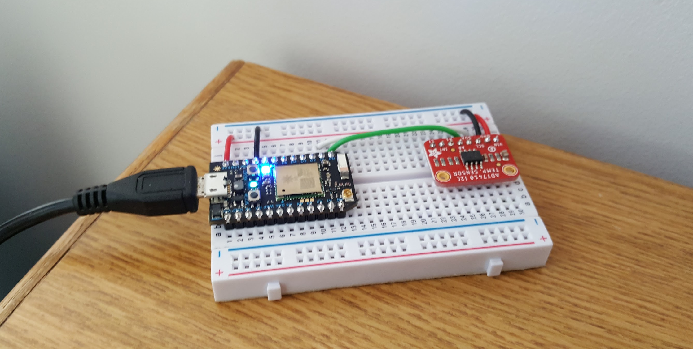
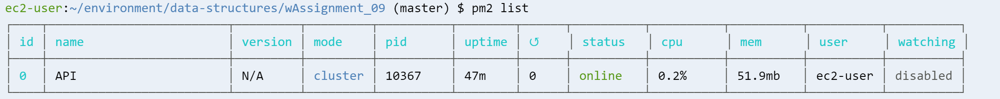
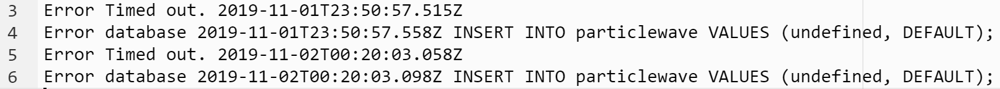
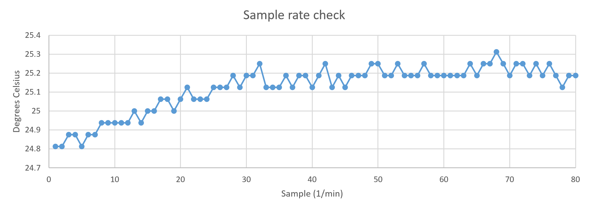
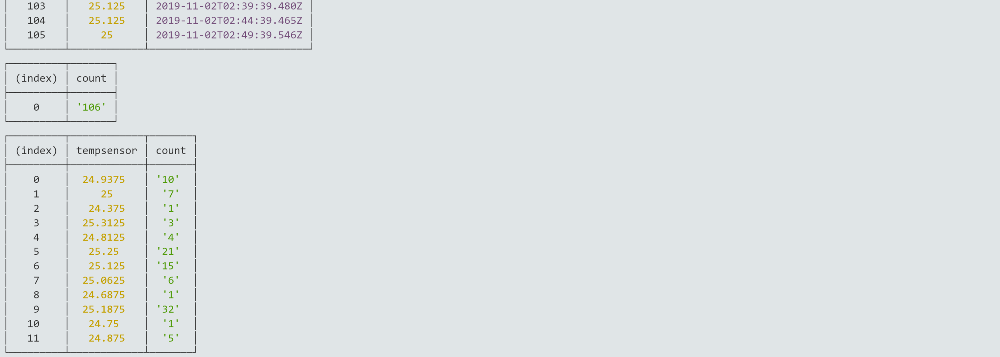
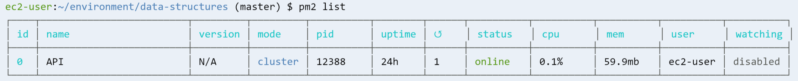
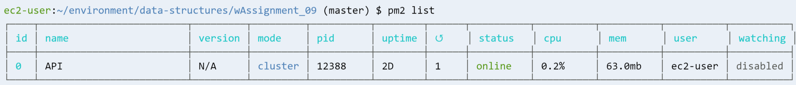
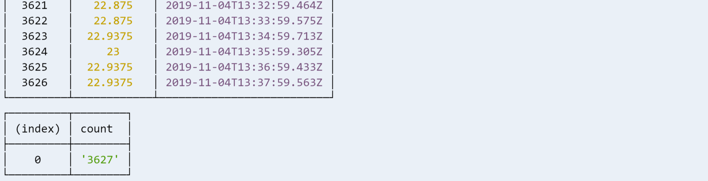

## MSDV PGDV5110 Weekly assignment 09 
(due: 11/04/2019 6pm )

### Summary:

This task consists of writing the Internet of Things (IoT) data to a 
database situated on Amazon Web Services (AWS).

The assignment is detailed in the [data structures course github page](https://github.com/visualizedata/data-structures/blob/master/weekly_assignment_09.md).


### Documentation:
--------------------------

It was decided to store temperature sensor data onto a PostgreSQL database.
The article Photon microprocessor board was assured to be stable and logging
data from the temperature sensor reliably. The sensor is located on a safe spot
on the corner of a desk.




A simple table is required that only
has the single temperature value and the associated timestamp.
The temperature sensor measures data in degrees Celsius and is stored 
as a double precision number.

```
var thisQuery =     "CREATE TABLE particlewave (\
                    tempsensor double precision,\
                    DBtime TIMESTAMP DEFAULT LOCALTIMESTAMP);";

```

The process was subsequently run using the [pm2](https://pm2.keymetrics.io/docs/usage/pm2-doc-single-page/)
process manager running on AWS Cloud9.

An example of the running process is given below.



In order to track missing data or issues with downtime, log files functionality was added.


```
if (!JSON.parse(body).ok ) {
    var nowmyISO = new Date().toISOString();
    console.log('Error ' + JSON.parse(body).error + ' ' + nowmyISO );
    
    fs.appendFile(fnameErr, 'Error ' + JSON.parse(body).error + ' ' + nowmyISO + '\n', function(err) {
        if (err) throw err;
    });
}
```

A single log file is currently created that documents both timeout issues
toward the particle board and database queries.
These are written locally onto the AWS environment and should be monitored.
Initial test were conducted by removing power to the Photon board, after which
errors were logged appropriately to the log files.
It is recommended to monitor these and refine as needed.

The example logfile is given below.


It is recommended to implement an email notification service as well for
for when logging issues occur. This functionality has not yet been implemented,
but the [Amazon SES](https://docs.aws.amazon.com/ses/latest/DeveloperGuide/examples-send-using-sdk.html) 
service will likely be used, although using [whatsapp](https://www.twilio.com/docs/sms/whatsapp/quickstart/node?code-sample=code-send-a-message-with-whatsapp-and-nodejs&code-language=Node.js&code-sdk-version=3.x)
is also being investigated.


### Output:
--------------------------

The minimum required sample rate is one measurement
every 5 minutes, which is deemed adequate from prior experience. Even so, a check 
was conducted at a sample rate of 1 sample per minute. The temperature is seen
to vary slowly and one sample for every 5 minutes is appropriate. 
It is recommended to re-evaluate the required sampling rate over 24 hours, since
even though it is nice to have higher sample rates, a trade-off has to be made
to gauge if it isn't too much data. This is partly also because logging data from 
additional sensors is being investigated in parallel (sensors which are beyond the scope
of this current assignment.


The example basic temperature plot of the first 80 minutes is shown below.



An example of the output for a database query is shown as well:



### Verification:
--------------------------

The outputs were checked again and verified to be working after 1 and 2 days:





#### Notes and dependencies

The is intented to be run on Cloud9 where all dependencies for development is already available;
[aws-sdk](https://docs.aws.amazon.com/AWSJavaScriptSDK/latest/) (for email services),  
[pm2](https://pm2.keymetrics.io/docs/usage/pm2-doc-single-page/) and [dotenv](https://www.npmjs.com/package/dotenv) and [pg](https://node-postgres.com/).

