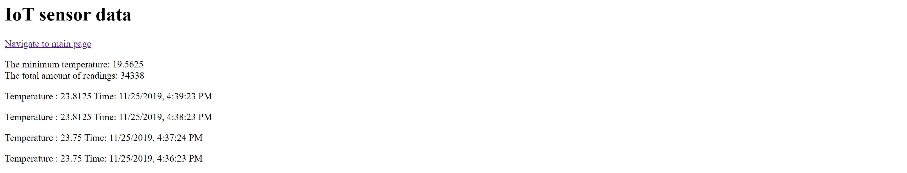

## MSDV PGDV5110 Weekly assignment 10 
(due: 11/18/2019 6pm; extension 11/25/2019 6pm )

### Summary:

This task consists of constructing a web application on Node/Express.
Data from all three assignments are gathered and attached to an front end point
website. Queries are constructed to aggregate the data for the final site.

The site is running on the AWS instance.

The assignment is detailed in the [data structures course github page](https://github.com/visualizedata/data-structures/tree/master/weekly_assignment_10).


### Documentation:
--------------------------

### The Landing page:
--------------------------


The web app is constructed in basic html without any significant styling.


### AA meetings page:
--------------------------


The AA meetings data page was constructed to allow the user selections on 
meeting day and meeting time. In order to avoid returning empty selections,
meeting times were grouped the same as the official AA meeting page; with 
ranges of morning, midday, evening and night.


```
   var aameetingQuery1 = "SELECT lat, long, json_agg(json_build_object('bldNm', buildingname, \
   'addr', address, 'time', timestart, 'name', meetingname, \
   'day', days, 'typ', meetingtype, 'wch', wheelchair)) as meetings\
                 FROM aameetflat GROUP BY lat, long;";
```


### Process blog page:
--------------------------


The process blog endpoint was constructed such that it is possible to navigate
using different categories using normal html links. Additional filtering with
dates still need to be added, depending on experimentation results. 
It is envisioned to either step through dates individually, or add a calender 
drop-down menu, or both, depending on the effect of each on user interaction.


### Sensor page:
--------------------------

The sensor page was split into two sections for now, however multiple views are
envisioned, depending on the total complexity that can be added in the alotted
time. 
Currently two endpoints were added; the first showing just the latest 20 entries,
however these will be expanded to show the latest day, week or month.





The second view aggregates maxima and minima for every hour over the entire date 
range for all values by constructing a more complicated database join.
The result takes long to compute and might have to be revised for better performance.
The query is based on code from [Dani Herra](https://stackoverflow.com/questions/13818524/moving-average-based-on-timestamps-in-postgresql).


```
var sensorQuery6 = "SELECT EXTRACT(hour FROM l1.DBtime) as sensorhour, MAX( l2.tempsensor2 )
    FROM weatherstation 
    l1 INNER JOIN weatherstation l2 ON l2.DBtime <= l1.DBtime AND 
    l2.DBtime + INTERVAL '60 minutes' > l1.DBtime 
    GROUP BY sensorhour ORDER BY sensorhour DESC;"
```


<!--* What will the visualization look like? Will it be interactive? If so, how?   -->
<!--* How will the data need to be mapped to the visual elements?  -->
<!--* For that mapping, what needs to be done to the data? Be specific and clear. Will it require filtering, aggregation, restructuring, and/or something else? How will this be done?  -->
<!--* What is the default view (if any)?  -->
<!--* What assumptions are you making about the user?  -->


