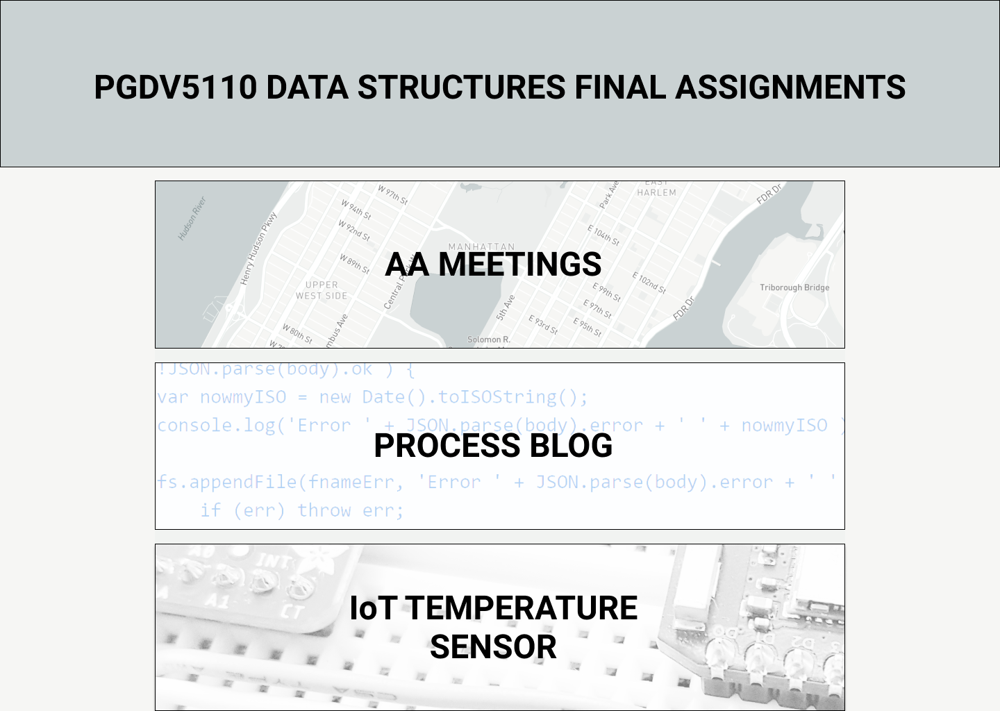
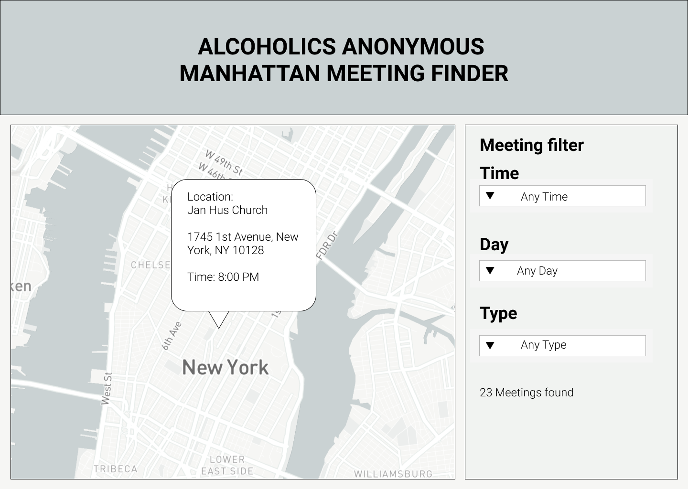
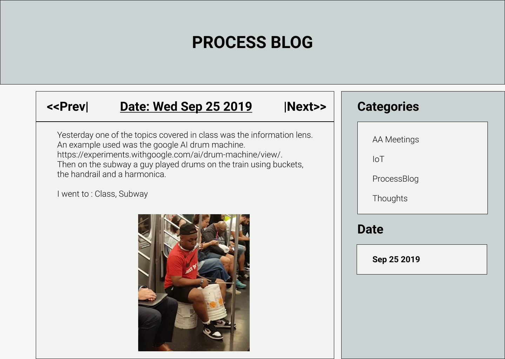
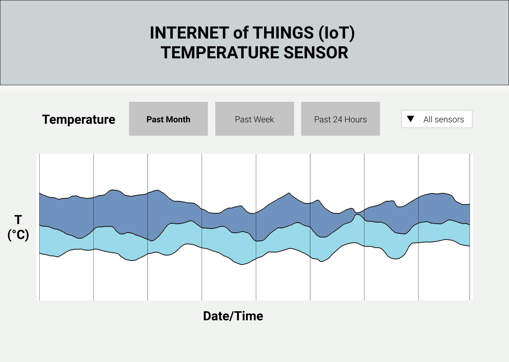

## MSDV PGDV5110 Weekly assignment 11 
(due: 11/18/2019 6pm; extension 11/25/2019 6pm )

### Summary:

This task consists of making illustrations/digital sketches for
designing website front-end interfaces to all three final assignments.

The assignment is detailed in the [data structures course github page](https://github.com/visualizedata/data-structures/blob/master/weekly_assignment_11.md).

### Documentation:
--------------------------

### The Landing page:
--------------------------

The main landing page will consist of three basic blocks with links to each 
of the final assignments. No data will be directly coupled to this page;
it will only contain the three links.

### AA meetings page:
--------------------------

* The AA meetings page will consist of a main graphic that shows the interactive map, 
wheras the sidebar will allow for data filtering according to pre-defined parameter
values of time, day and meeting type using drop-down boxes.
A clickable marker popup will be added on the map and contain the meeting details for 
each individual geolocation.

* Data will be mapped to the visual elements by using geolocation details queried from 
the PostgreSQL tables and added to the map markers using the Leaflet map layer libraries.
For this purpose an object structure will be used; more specifically: an array of objects. 
Coordinates for each marker will be bound directly from the geolocation data, 
whereas the content of the popup will be from data of the combined meeting 
days and times at that specific location.

* For mapping the query needs to be aggregated according to geolocation. It was envisioned
to have two PostgreSQL tables; one containing only location data and another only meeting data, however
in order to filter the geolocations by times and days, all the meeting data is required irrespectively, 
since binding the meeting data to marker popups will be difficult if it wasn't included into markers from the start.
Hence the initial flat table structure will be used in the final assignment 
and query-selected with filtering parameters according to day, time 
and meeting type. Afterward the filtered list will be aggregated according to geolocation in order
to keep same-location meetings grouped and make sure no redundancy exists on geolocations (i.e that 
multiple markers don't fall on the same place).

* Restructuring will occur during aggregation, since multiple meeting details will be grouped under a single geolocation.
The output from the database will therefore be an array of objects that each contain geolocations and also an array of meetings information.
Filtering is done using native PostgreSQL commands `SELECT ... FROM ... WHERE` and 
aggregation is done with `json_agg` and `json_build_object`.
Note that once filtering is done, meeting times are expected to be sparse, which
could result in empty selections and user frustration, hence it is deemed beneficial to group times into 
categories, such as morning, afternoon and night; just like the [official AA meeting page](https://www.nyintergroup.org/meetings/?tsml-view=map)

* For the default view the map will be populated with data from all locations and all meeting days and types.
  When filtering is applied these will be reduced according to the filtered output data. The user will be able to
  go back to the full list, hence the dropdown menu will contain the option to show all meetings.  

* The assumptions are that the user will have some basic ability to use drop-down menus and will be able to 
  use a map with clickable markers and that the user will have an interface that makes this possible. 
  However, it is recommended to consider adding a simple table view as well (if time allows), 
  just like the official AA meetings website, since some users might be more comfortable using a simple table.

### Process blog page:
--------------------------

* The Process Blog page will consist of a main screen element and a side-bar.
  The main element will show the latest blog post, whereas
  the sidebar will contain navigation/filtering selection elements of category and date.
  The category selections are planned as links and the date selection as calendar drop-down,
  however some experimentation is required to see which date selection drop-down works best.
  It is also envisioned to have a date navigation above the blog post, giving the user the ability to 
  step through posts of previous dates. However, this will require some experimentation as well, since
  stepping through many dates could be tedious, in which case only the right-handle
  side date selection will be retained. 

* The process blog is deemed simpler than the other assignments and will consist of a page
  that is populated primarily with html text through the handlebars templating system. 
  An image link will also be used and linked with images stored on the app server on AWS.

* The default view will be the latest blog, but previous blogs in the same filtered category staggered below, 
  but with images hidden. The data will therefore be queried according to the category, but only the latest post
  (or the selected date) will be fully visible. When the user navigates a following or previous post, that post
  will then become fully visible.

* It is assumed that the user will have some basic ability to navigate websites.

### Sensor page:
--------------------------

* The sensor page will consist of a main view with filtering dropdowns/buttons above it.
 The total level of interactivity will be implemented in phases, with the base functionality
being the user ability to select data plotted for the past day, week or month. 
A basic tooltip is planned in order to hover over data and show the temperature value at a specific datapoint.
More functionality with multiple sensor data is planned, but will be implemented to the extent that time and complexity allows.

* Data will be mapped to elements using a simple line chart of time and temperature value (time/date on the 
 horizontal axis and temperature value in degC on the vertical axis).
 The axes ranges will be determined using the data ranges. The D3.js library will be used.

* Since there are many more datapoints than visually required, datapoints will be averaged according
to the time range in order to make the amount of points manageable. It would hardly make sense to plot data for 
every minute accross a month, hence monthly data will be averaged over hours or minutes. The same will be done 
on data plotted by week. Averaging will be done in the database query as far as possible in order to limit the 
burden of transferring data points over the network. The query will be constructed using the `AVG` command
over time data per hour and/or minute intervals.

* The default view is planned as data for the past week.
* It is assumed the user will have some basic understanding of line charts and basic abilities to interact 
with web pages.

<!--* What will the visualization look like? Will it be interactive? If so, how?   -->
<!--* How will the data need to be mapped to the visual elements?  -->
<!--* For that mapping, what needs to be done to the data? Be specific and clear. Will it require filtering, aggregation, restructuring, and/or something else? How will this be done?  -->
<!--* What is the default view (if any)?  -->
<!--* What assumptions are you making about the user?  -->

